# ShopSphere - Spring Boot E-Commerce

[](https://adoptium.net/)
[](https://spring.io/projects/spring-boot)
[](./LICENSE)
[](https://github.com/<your-github-username>/<your-repo-name>/actions)

> Update `<your-github-username>` and `<your-repo-name>` in the build badge URL after pushing to GitHub.

ShopSphere is a full-stack e-commerce web application built with Spring Boot, Thymeleaf, JPA, and PostgreSQL.
It supports user shopping flows, cart/checkout/order lifecycle, and a role-based admin panel for managing products, users, and orders.

## Highlights

- User registration, login, profile management
- Role-based access (`ROLE_USER`, `ROLE_ADMIN`)
- Product browsing, category filtering, and search
- Product details with quantity-aware add-to-cart and buy-now
- Cart management (add, update, increase/decrease, remove)
- Checkout flow (direct buy + cart checkout)
- Order history, order success page, cancel order support
- Order status timeline model: `PLACED -> PACKED -> SHIPPED -> DELIVERED` (+ `CANCELLED`)
- Admin panel:
  - Product CRUD + stock update
  - Order management + status transitions + user-based filtering
  - User management (edit/delete) + role promotion/demotion
- Dockerized setup with PostgreSQL

## Tech Stack

- Java 21
- Spring Boot 3.3.8
- Spring MVC + Thymeleaf
- Spring Data JPA (Hibernate)
- Spring Security (custom session-based authorization)
- BCrypt password hashing
- PostgreSQL (primary DB)
- H2 (runtime dependency)
- Maven
- Docker + Docker Compose
- Lombok

## Architecture Overview

### Layered Design

- `controller` - request handling and web flows
- `service` - business logic
- `repository` - persistence layer
- `entity` - JPA domain model
- `config` - security, interceptor, password encoder, data backfills
- `templates` - Thymeleaf UI (`user/`, `admin/`)
- `static` - CSS/JS/assets

### Project Structure

```text
src/main
|- java/com/techouts
|  |- config
|  |- controller
|  |- entity
|  |- repository
|  |- service
|  \- SpringBootEcommerceApplication.java
\- resources
   |- static
   |- templates
   |  |- user
   |  \- admin
   \- application.properties
```

## Roles and Authorization

### Roles

- `ROLE_USER` - default for newly registered users
- `ROLE_ADMIN` - access to `/admin/**`

### Access Rules

- Public: `/`, `/index`, `/login`, `/register`, product pages, static assets
- Authenticated user required: cart/checkout/orders/profile flows
- Admin required: all `/admin/**` routes

### Admin Bootstrap Note

For backward compatibility in existing data, the app still treats username `admin` as admin if role is missing/legacy.
Recommended approach: login as existing admin and assign `ROLE_ADMIN` using **Admin -> Users**.

## Core Workflows

### User Shopping Flow

1. Register/Login
2. Browse products on `index`/`home`
3. Add to cart or Buy Now
4. Checkout with address + payment mode
5. Place order
6. Track in Orders, cancel if eligible

### Admin Workflow

1. Login as admin
2. Manage products (create/update/delete/stock)
3. Manage orders (filter/sort/status updates)
4. Manage users (edit/delete, role updates)

## Main Routes

### User Routes

- `GET /, /index`
- `GET /home`
- `GET /product/{id}`
- `GET/POST /register`
- `GET/POST /login`
- `GET /logout`
- `GET /profile`
- `POST /profile/update`
- `GET /cart`
- `POST /cart/add`
- `GET /cart/count`
- `POST /cart/update/{itemId}` (plus increase/decrease/remove)
- `GET /buy-now`
- `GET /checkout`
- `POST /checkout/place`
- `GET /orders`
- `POST /orders/cancel`
- `GET /order-success`

### Admin Routes

- `GET /admin`
- `GET /admin/products`
- `GET /admin/products/new`
- `GET /admin/products/{id}`
- `GET /admin/products/{id}/edit`
- `POST /admin/products/save`
- `POST /admin/products/{id}/stock`
- `POST /admin/products/{id}/delete`
- `GET /admin/orders`
- `POST /admin/orders/{id}/status`
- `GET /admin/users`
- `GET /admin/users/{id}/edit`
- `POST /admin/users/{id}/save`
- `POST /admin/users/{id}/delete`
- `POST /admin/users/{id}/role`

## Database and Migrations

- JPA mode: `spring.jpa.hibernate.ddl-auto=update`
- Includes startup backfills:
  - `OrderStatusBackfillConfig` - sets null order statuses to `PLACED`
  - `UserRoleBackfillConfig` - assigns missing roles (`admin` -> `ROLE_ADMIN`, others -> `ROLE_USER`)

## Local Setup (Without Docker)

### Prerequisites

- JDK 21
- Maven 3.9+
- PostgreSQL 15+

### 1) Clone

```bash
git clone <your-repo-url>
cd SpringBootEcommerce
```

### 2) Create Database

Create a PostgreSQL database (example name: `techouts`).

### 3) Configure Environment Variables (recommended)

```bash
SPRING_DATASOURCE_URL=jdbc:postgresql://localhost:5432/techouts
SPRING_DATASOURCE_USERNAME=postgres
SPRING_DATASOURCE_PASSWORD=admin
PORT=8080
```

If env vars are not set, defaults from `application.properties` are used.

### 4) Run Application

```bash
mvn clean spring-boot:run
```

Open: `http://localhost:8080`

## Seed Data

- `data.sql` contains sample product data.
- In Docker Compose, this file is mounted into PostgreSQL init scripts.

## Screenshots and GIFs

Add screenshots/GIFs to `docs/screenshots/` and keep these names (or update paths below):
- `docs/screenshots/user-register.png`
- `docs/screenshots/user-login.png`
- `docs/screenshots/user-home.png`
- `docs/screenshots/user-cart.png`
- `docs/screenshots/user-checkout.png`
- `docs/screenshots/user-orders.png`
- `docs/screenshots/admin-products.png`
- `docs/screenshots/admin-orders.png`
- `docs/screenshots/admin-users.png`
- `docs/screenshots/admin-user-edit.png`
- `docs/screenshots/user-flow.gif`
- `docs/screenshots/admin-flow.gif`

### User Module

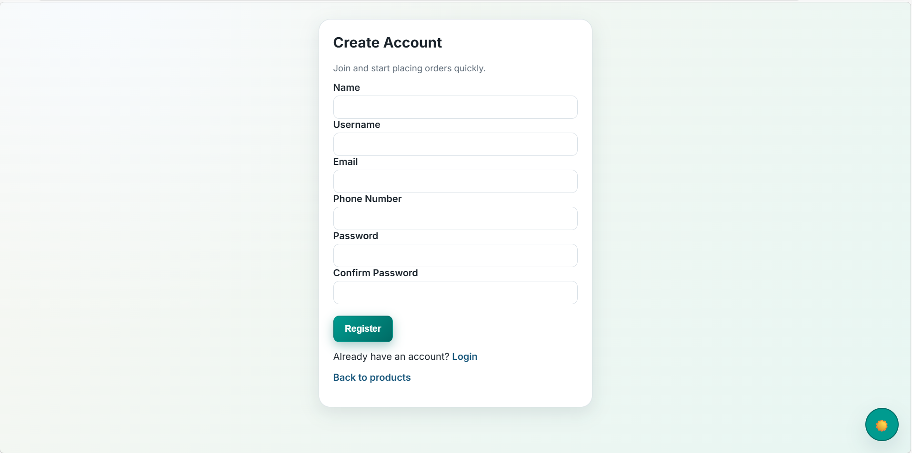
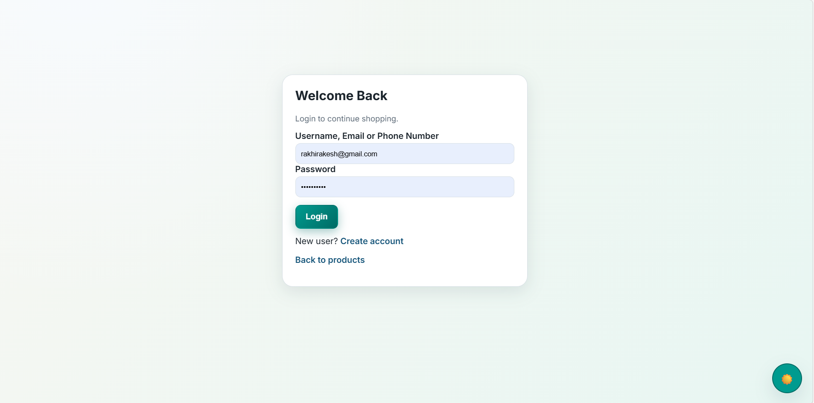
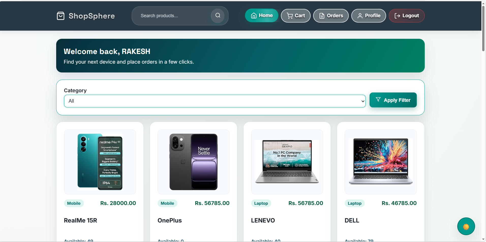
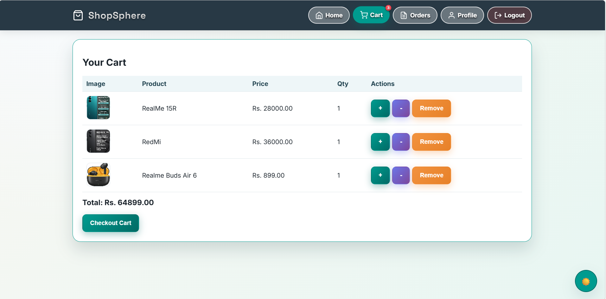
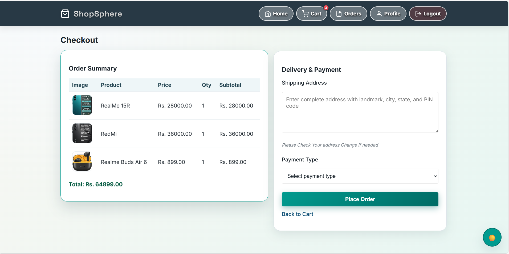
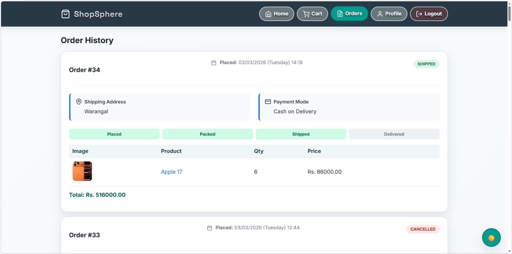
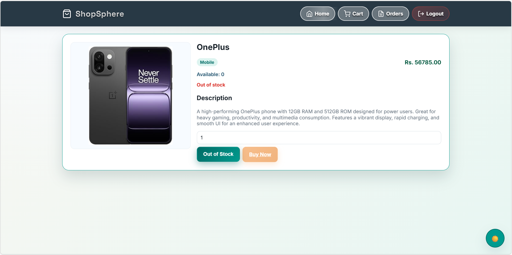


### Admin Module

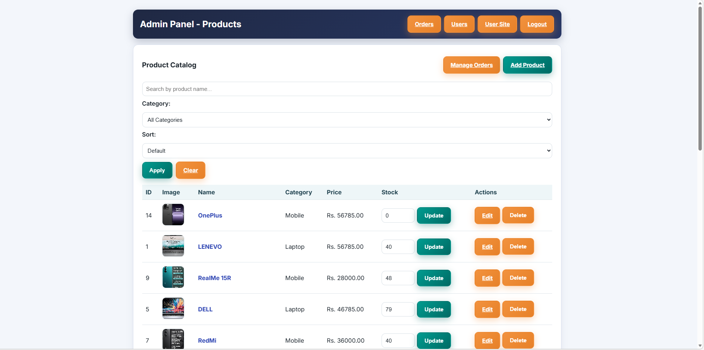
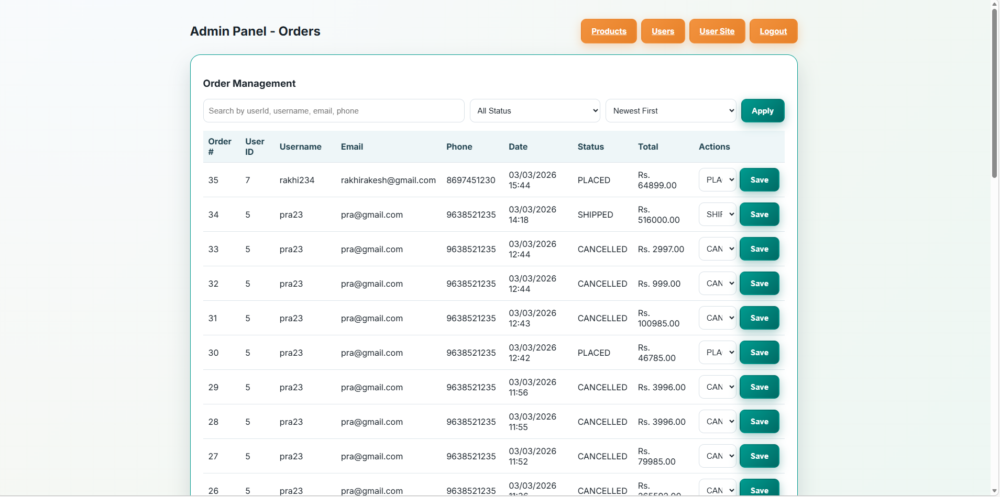
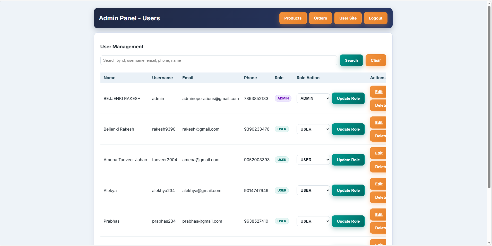
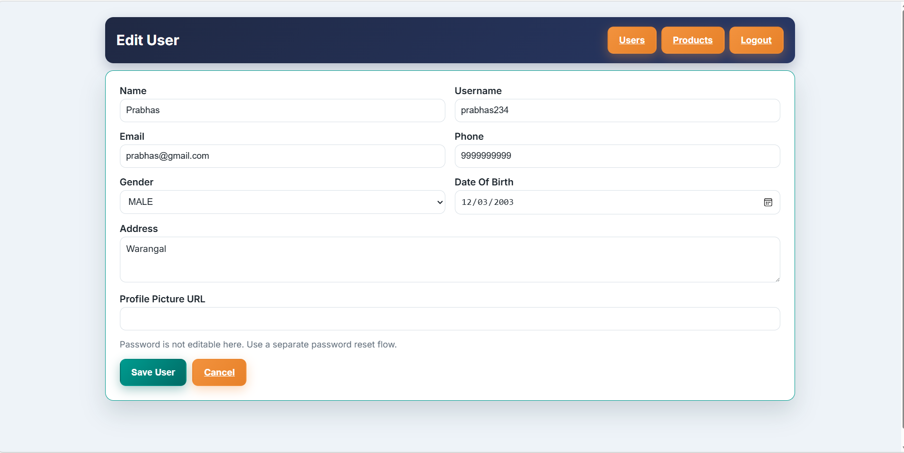


## Security Notes

- Passwords are hashed using BCrypt.
- Default generated Spring Security password message is disabled by custom security config.
- Session attribute-driven authorization is used for route access.

## Deployment Notes

- Externalize DB credentials via environment variables
- Set `ddl-auto` strategy appropriately for production
- Add centralized logging + monitoring
- Add CSRF and stronger auth hardening before public deployment
